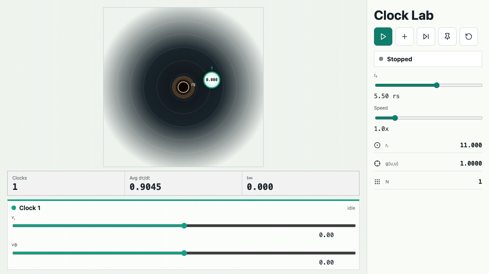

# Schwarzschild Clock Lab

Interactive browser lab for exploring how clocks drift in Schwarzschild spacetime. Add clocks, tune their initial coordinate velocities, switch between free fall and pinned worldlines, and watch proper time diverge near the event horizon.



## What It Shows

- Gravitational time dilation through the live `dτ/dt` readout.
- Radial and tangential coordinate velocity controls for each clock.
- Free-fall trajectories integrated in Schwarzschild coordinates.
- Pinned clocks that hold position and accumulate proper time at the local static-observer rate.
- Timelike normalization checks with `g(u,u)` for the lead clock.
- Horizon stopping behavior when a free-fall clock reaches the exterior integration boundary.

## Controls

- **Play / Pause** starts or stops the current simulation state.
- **Add clock** creates another clock at a nearby radius.
- **Free fall** prepares every clock with its configured radial and tangential velocities.
- **Pin** toggles clocks between held-at-radius and free-fall behavior.
- **Reset** rebuilds the scene from the selected initial radius.
- **r0** sets the radius used for new clocks and resets.
- **Speed** changes the coordinate-time playback multiplier.

## Physics Model

The simulation uses the Schwarzschild metric with `rs = 2` in geometric units. Static clock rates are computed as:

```txt
dτ/dt = sqrt(1 - rs / r)
```

Free-fall clocks use a fourth-order Runge-Kutta step over proper time, then advance until the requested coordinate-time interval is reached. The app keeps the model intentionally compact: it is designed for intuition and visual experimentation, not high-precision numerical relativity.

## Development

```bash
npm install
npm run dev
```

Useful scripts:

```bash
npm run build
npm test
npm run preview
```

## GitHub About

Suggested repository description:

```txt
Interactive Schwarzschild clock lab for exploring gravitational time dilation, proper time, and free-fall worldlines.
```

Suggested topics:

```txt
general-relativity, schwarzschild, time-dilation, physics-simulation, react, vite, typescript
```
